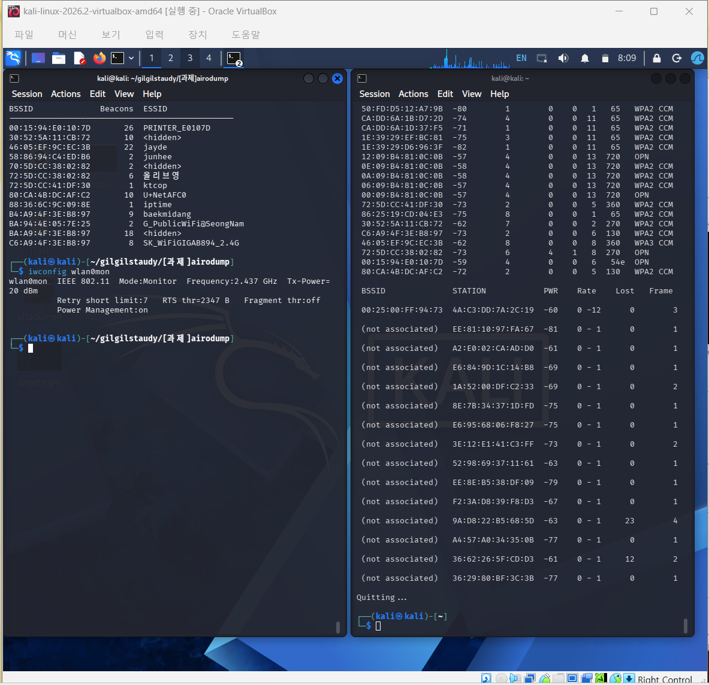

# airodump

`libpcap`으로 모니터 모드 무선 인터페이스의 802.11 Beacon Frame을 수집하여 AP별 BSSID, Beacon 개수, ESSID를 출력하는 프로그램입니다.

## 구현 범위

- Radiotap의 `it_len`을 사용한 가변 길이 헤더 처리
- IEEE 802.11 Management/Beacon Frame 판별
- `addr3`에서 BSSID 추출
- Tagged Parameter의 SSID Information Element 탐색
- AP별 Beacon 누적 집계
- Hidden SSID 및 잘린 패킷 처리

현재 과제의 첫 번째 완료 범위인 `BSSID + Beacons + ESSID`만 구현했습니다. PWR, Data, ENC, Station 및 Channel Hopping은 포함하지 않았습니다.

## 요구 사항

- Linux
- 모니터 모드를 지원하는 무선 랜카드
- `g++`, `make`, `libpcap-dev`

Ubuntu/Kali Linux 예시:

```bash
sudo apt update
sudo apt install g++ make libpcap-dev aircrack-ng
```

## 빌드

```bash
make
```

## 모니터 모드 준비

본인이 소유하거나 명시적으로 허가받은 무선 네트워크에서만 사용합니다.

```bash
sudo airmon-ng check kill
sudo airmon-ng start wlan0
iwconfig
```

환경에 따라 `wlan0mon` 대신 다른 인터페이스 이름이 생성될 수 있습니다.

## 실행

```bash
sudo ./airodump <monitor-interface>
```

예시:

```bash
sudo ./airodump wlan0mon
```

출력 예시:

```text
BSSID              Beacons  ESSID
-----------------------------------------------
00:11:22:AA:BB:CC       42  TestAP
10:20:30:40:50:60       17  <hidden>
```

종료하려면 `Ctrl+C`를 누릅니다.

## 정리

```bash
sudo airmon-ng stop wlan0mon
sudo systemctl restart NetworkManager
```

## 실행 결과

[](evidence/airodump-demo.mp4)

[▶ 실행 영상 보기](evidence/airodump-demo.mp4)
