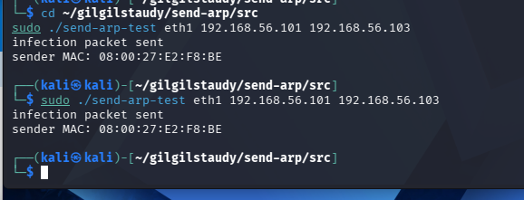
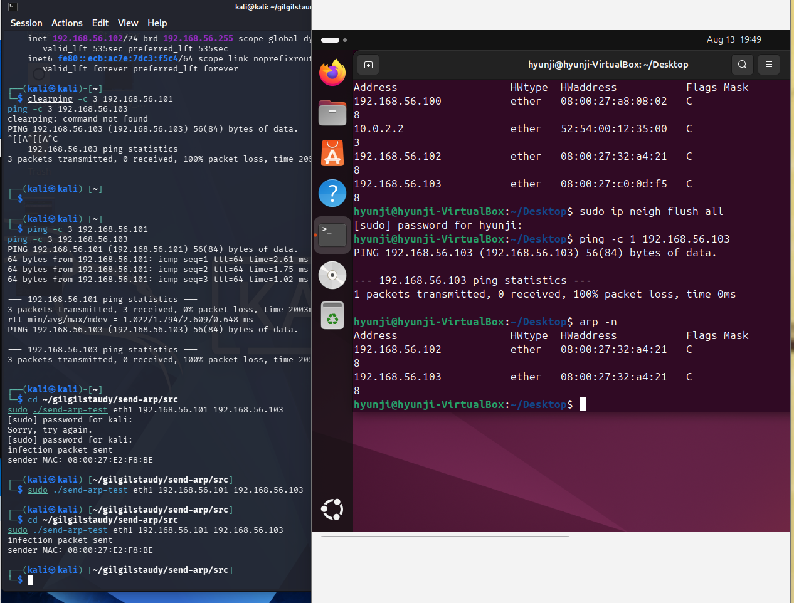

# arp-spoof

ARP spoofing 프로그램 구현 과제입니다.

## 요구 사항

- Linux
- g++
- libpcap-dev

## 실행

```bash
sudo ./arp-spoof <interface> <sender IP 1> <target IP 1> [<sender IP 2> <target IP 2> ...]
```

예시:

```bash
sudo ./arp-spoof eth0 172.30.1.17 172.30.1.254
```

## 개인 실습 환경 구성

여러 대의 물리 장비 대신 한 컴퓨터에서 가상머신 3대를 실행해 폐쇄된 실습망을 구성했습니다. 각 가상머신은 다음 역할을 담당합니다.

- Kali Linux: 공격자 (`192.168.56.102`)
- Ubuntu: sender (`192.168.56.101`)
- Windows: target (`192.168.56.103`)

세 장비를 동일한 `192.168.56.0/24` 가상 네트워크에 연결하고, 각 장비의 IP 주소와 네트워크 인터페이스를 확인했습니다.


ARP spoofing 구현에 앞서 `send-arp-test`로 sender와 target 사이의 ARP 감염을 검증했습니다.

```bash
sudo ./send-arp-test eth1 192.168.56.101 192.168.56.103
```



sender의 ARP 테이블에서 target(`192.168.56.103`)의 MAC 주소가 공격자(`192.168.56.102`)와 같은 주소로 변경된 것을 확인했습니다.



## 실습 영상

한 컴퓨터에서 공격자, sender, target 역할의 가상머신 3대를 구성해 진행한 실습 영상입니다.

https://github.com/user-attachments/assets/13aa1380-d003-4137-a1f5-7f8ff453156b

원본 영상은 [`arp-spoof-demo.mp4`](arp-spoof-demo.mp4)로 함께 제출했습니다.

## 참고

- ps. 와이어샤크 켜야하는데 생각해보니까 안키고했네요,,,, gpt말만 듣지맙시다,,,,,,,
