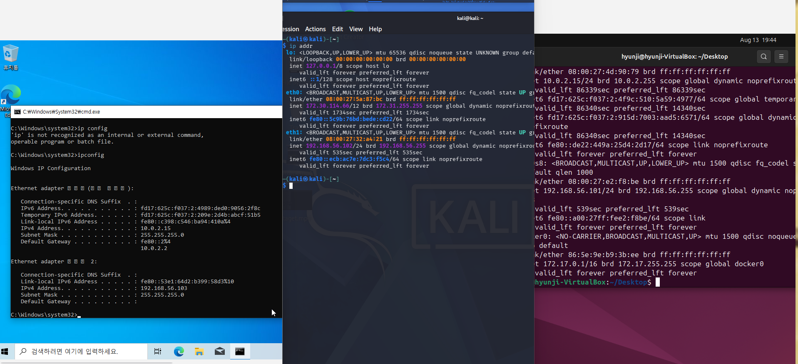
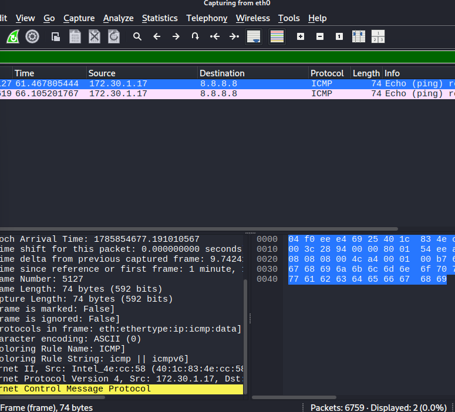

# send-arp

ARP 감염 패킷을 전송하는 프로그램입니다. 공격자의 MAC 주소를 특정 IP 주소의 MAC 주소인 것처럼 sender에게 알려 ARP 캐시를 변조합니다.

## 요구 사항

- Linux
- g++
- libpcap-dev

Kali Linux에서는 다음 명령으로 의존성을 설치할 수 있습니다.

```bash
sudo apt update
sudo apt install g++ libpcap-dev
```

## 실행

```bash
sudo ./send-arp <interface> <sender IP> <target IP> [<sender IP 2> <target IP 2> ...]
```

예시:

```bash
sudo ./send-arp eth0 172.30.1.17 172.30.1.254
```

여러 sender/target 조합도 한 번에 지정할 수 있습니다.

```bash
sudo ./send-arp eth0 172.30.1.17 172.30.1.254 172.30.1.18 172.30.1.254
```

## 개인 실습 환경 구성

여러 대의 물리 장비 대신 한 컴퓨터에서 가상머신 3대를 실행해 폐쇄된 실습망을 구성했습니다. 각 가상머신은 다음 역할을 담당합니다.

- Kali Linux: 공격자 (`192.168.56.102`)
- Ubuntu: sender (`192.168.56.101`)
- Windows: target (`192.168.56.103`)

세 장비를 동일한 `192.168.56.0/24` 가상 네트워크에 연결하고, 각 장비의 IP 주소와 네트워크 인터페이스를 확인했습니다.



Kali Linux에서 다음과 같이 sender와 target을 지정해 ARP 감염 패킷을 전송했습니다.

```bash
sudo ./send-arp-test eth1 192.168.56.101 192.168.56.103
```


sender의 ARP 테이블을 확인한 결과, target(`192.168.56.103`)의 MAC 주소가 공격자(`192.168.56.102`)와 같은 주소로 변경된 것을 확인했습니다.


## 실행 결과

Wireshark에서 sender(`172.30.1.17`)가 외부 주소(`8.8.8.8`)로 보내는 ICMP 패킷을 확인했습니다.



## 시연 영상

### Attacker

https://github.com/user-attachments/assets/5deeb1b8-e269-45ae-8835-a4db14010cee

### Target

https://github.com/user-attachments/assets/486ac9b0-17c9-4492-ac79-7808e7187a8c
