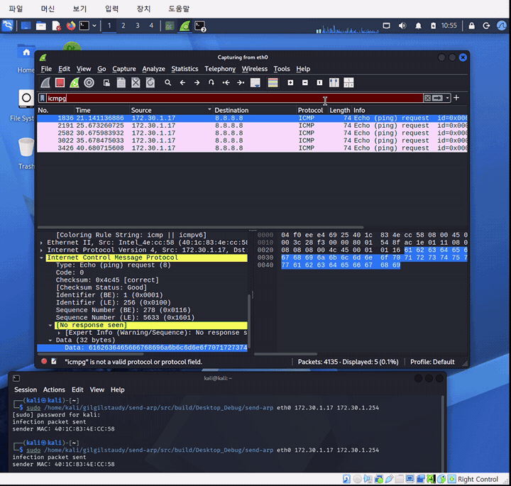
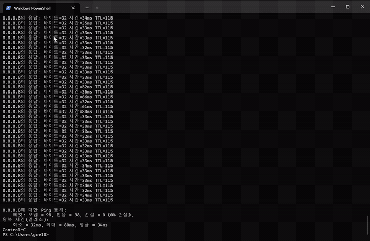

# send-arp

ARP 감염 패킷을 전송하는 프로그램입니다. 공격자의 MAC 주소를 특정 IP 주소의 MAC 주소인 것처럼 sender에게 알려 ARP 캐시를 변조합니다.

## 요구 사항

- Linux
- g++
- libpcap-dev

Kali Linux에서는 다음 명령으로 의존성을 설치할 수 있습니다.

```bash
sudo apt update
sudo apt install g++ libpcap-dev
```

## 빌드

```bash
cd "[과제]send-arp"
make
```

## 실행

```bash
sudo ./send-arp <interface> <sender IP> <target IP> [<sender IP 2> <target IP 2> ...]
```

예시:

```bash
sudo ./send-arp eth0 172.30.1.17 172.30.1.254
```

여러 sender/target 조합도 한 번에 지정할 수 있습니다.

```bash
sudo ./send-arp eth0 172.30.1.17 172.30.1.254 172.30.1.18 172.30.1.254
```

## 실행 결과

Wireshark에서 sender(`172.30.1.17`)가 외부 주소(`8.8.8.8`)로 보내는 ICMP 패킷을 확인했습니다.


## 시연 영상

### Attacker

[](https://raw.githubusercontent.com/guswl03/gilgilstaudy/main/%5B%EA%B3%BC%EC%A0%9C%5Dsend-arp/attacker.mp4)

[Attacker 원본 MP4 바로 재생](https://raw.githubusercontent.com/guswl03/gilgilstaudy/main/%5B%EA%B3%BC%EC%A0%9C%5Dsend-arp/attacker.mp4)

### Target

[](https://raw.githubusercontent.com/guswl03/gilgilstaudy/main/%5B%EA%B3%BC%EC%A0%9C%5Dsend-arp/target.mp4)

[Target 원본 MP4 바로 재생](https://raw.githubusercontent.com/guswl03/gilgilstaudy/main/%5B%EA%B3%BC%EC%A0%9C%5Dsend-arp/target.mp4)
